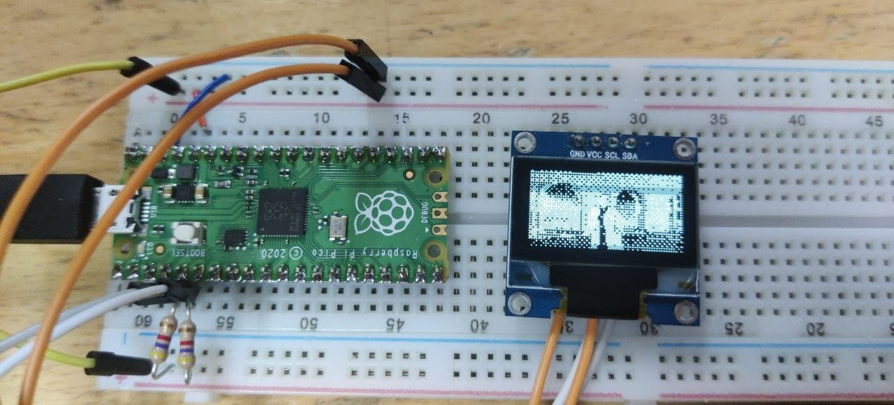

# Example

A simple demonstration showing how to control an OLED display (SSD1306) via I2C.

## Contents

* 400khz.sh - Run as root, this script switches I2C speed from 100kHz to 400kHz
* disable_kde_compositor.sh - Run as your user, this script disables the compositor function of the KDE desktop, which causes problems when capturing the screen with FFMPEG
* run.sh - Run as root, this script starts FFMPEG to record the screen, piping the raw video data to the Python script, run this script to start the demonstration
* ssd1306.py - A very simple and ugly SSD1306 OLED driver in Python using the smbus python library




[](http://www.youtube.com/watch?v=PMtY5OU9V3Q "Demonstration video")


## Linux tools

You can easily list and access the I2C busses of your computer, including the bus exposed by this project by loading the i2c-dev kernel module. Please do watch out: some devices on internal I2C busses  inside your computer may malfunction or cause damage when probing busses or performing read/write operations using these tools.

You can find the device number of the RP2040 I2C adapter by running the dmesg command right after plugging in the device. You are looking for the following line of information:

```
$ sudo dmesg
...
i2c i2c-1: connected i2c-tiny-usb device
```

In this example the I2C bus number assigned to the RP2040 I2C adapter is 1. This means the device file is `/dev/i2c-1` and the sysfs interface is `/sys/bus/i2c/devices/i2c-1`.

To enable access to the I2C busses of the computer via the device file the i2c-dev kernel module needs to be loaded.

```
sudo modprobe i2c-dev
```

Busses can then be probed using i2cdetect:

```
sudo i2cdetect -y 1
```

In which the number (1) is the bus number. To scan all I2C addresses add the `-a` flag before the bus number.

To read a value from a register in an I2C device the i2cget command can be used:

```
sudo i2cget -y 1 0x28 0x00
```

In which 1 is the bus number, 0x28 is the I2C device address and 0x00 is the register number.

To write a value to a register in an I2C device the i2cset command can be used:

```
sudo i2cset -y 1 0x28 0x00 0x42
```

In wich 1 is the bus number, 0x28 is the I2C device address, 0x00 is the register number and 0x42 is the value written to the register.
